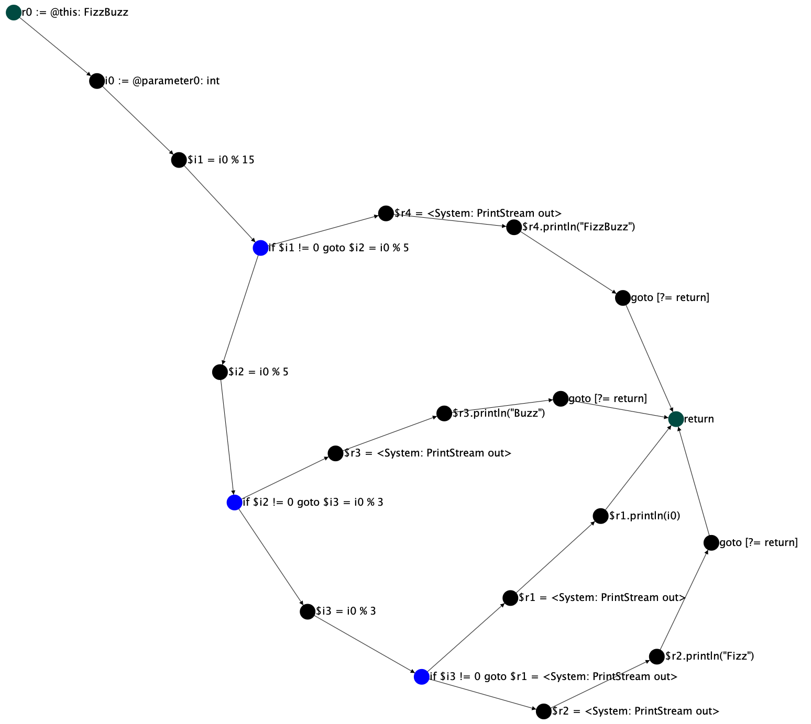
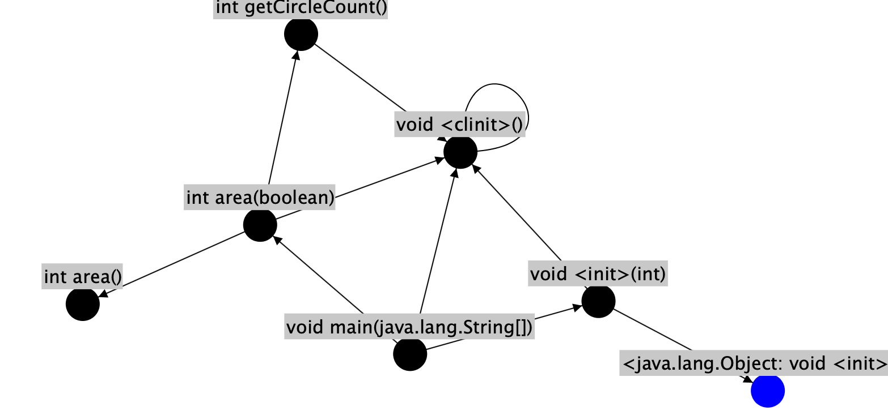
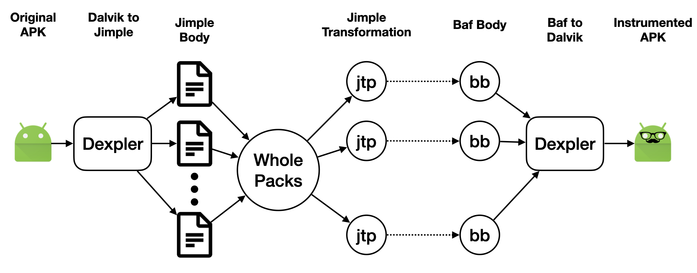
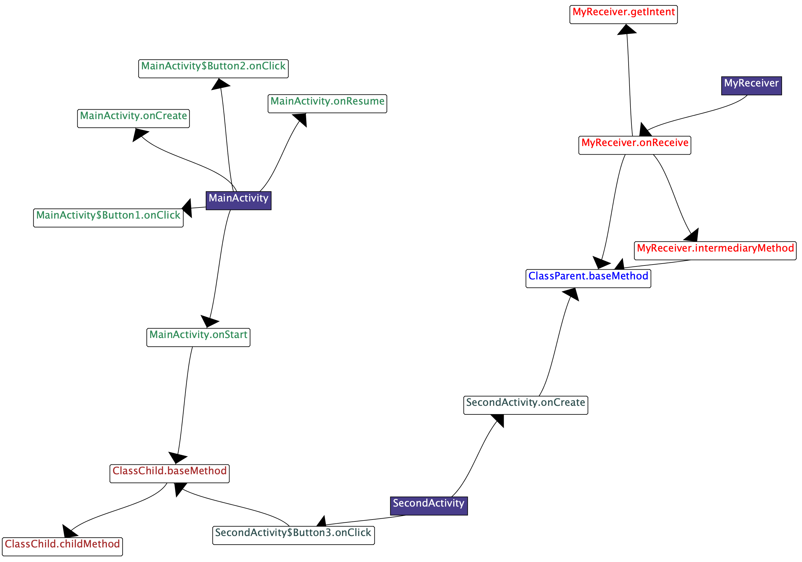

# Soot Tutorial
[](https://travis-ci.com/noidsirius/SootTutorial)
[](https://gitpod.io/#https://github.com/noidsirius/SootTutorial)
[](https://hub.docker.com/r/noidsirius/soot_tutorial)


This repository contains (will contain) several simple examples of static program analysis in Java using [Soot](https://github.com/Sable/soot).

## Who this tutorial is for?
Anybody who knows Java programming and wants to do some static analysis in practice but does not know anything about Soot and static analysis in theory.

If you have some prior knowledge about static program analysis I suggest you learn Soot from [here](https://github.com/Sable/soot/wiki/Tutorials).

### [Why another tutorial for Soot?](docs/Other/Motivation.md)

## Setup
In short, use Java 8 and run `./gradlew build`. For more information and Docker setup, follow this [link](docs/Setup/). 

## Chapters
### 1: Get your hands dirty

In this chapter, you will visit a very simple code example to be familiar with Soot essential data structures and **Jimple**, Soot's principle intermediate representation.

* `./gradlew run --args="HelloSoot"`: The Jimple representation of the [printFizzBuzz](demo/HelloSoot/FizzBuzz.java) method alongside the branch statement.
* `./gradlew run --args="HelloSoot draw"`: The visualization of the [printFizzBuzz](demo/HelloSoot/FizzBuzz.java) control-flow graph.


|Title |Tutorial | Soot Code        | Example Input  |
| :---: |:-------------: |:-------------:| :-----:|
|Hello Soot |[Doc](docs/1/)      | [HelloSoot.java](src/main/java/dev/navids/soottutorial/hellosoot/HelloSoot.java) | [FizzBuzz.java](demo/HelloSoot/FizzBuzz.java) |



### 2: Know the basic APIs

In this chapter, you get familiar with some basic but useful methods in Soot to help read, analyze, and even update java code.

* `./gradlew run --args="BasicAPI"`: Analyze the class [Circle](demo/BasicAPI/Circle.java).
* `./gradlew run --args="BasicAPI draw"`: Analyze the class [Circle](demo/BasicAPI/Circle.java) and draws the call graph.

|Title |Tutorial | Soot Code        | Example Input  |
| :---: |:-------------: |:-------------:| :-----:|
|Basic API |[Doc](https://medium.com/@noidsirius/know-the-basic-tools-in-soot-18f394318a9c)| [BasicAPI.java](src/main/java/dev/navids/soottutorial/basicapi/BasicAPI.java) | [Circle](demo/BasicAPI/Circle.java) |




### 3: Android Instrumentation

In this chapter, you learn how to insert code into Android apps (without having their source code) using Soot. To run the code, you need Android SDK (check this [link](docs/Setup/)).

* `./gradlew run --args="AndroidLogger"`: Insert logging method calls at the beginning of APK methods of [Numix Calculator](demo/Android/calc.apk).
* `./gradlew run --args="AndroidClassInjector"`: Create a new class from scratch and inject it to the  [Numix Calculator](demo/Android/calc.apk).

The instrumented APK is located in `demo/Android/Instrumented`. You need to sign it in order to install on an Android device:
```sh
cd ./demo/Android
# on Windows, replace 'sign.sh' by 'sign.ps1'
./sign.sh Instrumented/calc.apk key "android"
adb install -r -t Instrumented/calc.apk
```
To see the logs, run `adb logcat | grep -e "<SOOT_TUTORIAL>"`

|Title |Tutorial | Soot Code        | Example APK|
| :---: |:-------------: |:-------------:| :-----:|
|Log method calls in an APK| [Doc](https://medium.com/@noidsirius/instrumenting-android-apps-with-soot-dd6f146ff4d2)| [AndroidLogger.java](src/main/java/dev/navids/soottutorial/android/AndroidLogger.java) | [Numix Calculator](demo/Android/calc.apk) (from [F-Droid](https://f-droid.org/en/packages/com.numix.calculator/))|
|Create and inject a class into an APK| [Doc](https://medium.com/@noidsirius/instrumenting-android-apps-with-soot-dd6f146ff4d2) | [AndroidClassInjector.java](src/main/java/dev/navids/soottutorial/android/AndroidClassInjector.java) | [Numix Calculator](demo/Android/calc.apk) (from [F-Droid](https://f-droid.org/en/packages/com.numix.calculator/))|



### 4: Call graphs and PointsTo Analysis in Android

This chapter gives you a brief overview o call graphs and PointsTo analysis in Android and you learn how to create calls graphs using FlowDroid. The source code of the example code is [here](demo/Android/STDemoApp). To run the code, you need Android SDK (check this [link](docs/Setup/)).

* `./gradlew run --args="AndroidCallGraph <CG_Algorithm> (draw)"`: Create the call graph of [SootTutorial Demo App](demo/Android/st_demo.apk) using `<CG_Algorithm>` algorithm and print information such as reachable methods or the number of edges.
    * `<CG_Algorithm>` can be `SPARK` or `CHA`
    * `draw` argument is optional, if provided a visualization of call graph will shown.
    * For example, `./gradlew run --args="AndroidCallGraph SPARK draw"` visualizes the call graph generated by SPARK algorithm.
* `./gradlew run --args="AndroidPTA"`: Perform PointsTo and Alias Analysis on [SootTutorial Demo App](demo/Android/st_demo.apk) using FlowDroid.

|Title |Tutorial | Soot Code        | Example APK|
| :---: |:-------------: |:-------------:| :-----:|
|Call graphs in Android| [Doc](https://medium.com/geekculture/generating-call-graphs-in-android-using-flowdroid-pointsto-analysis-7b2e296e6697)| [AndroidCallgraph.java](src/main/java/dev/navids/soottutorial/android/AndroidCallgraph.java) | [SootTutorial Demo App](demo/Android/st_demo.apk) ([source code](demo/Android/STDemoApp))|
|PointsTo Analysis in Android| [Doc](https://medium.com/geekculture/generating-call-graphs-in-android-using-flowdroid-pointsto-analysis-7b2e296e6697)| [AndroidPointsToAnalysis.java](src/main/java/dev/navids/soottutorial/android/AndroidPointsToAnalysis.java) | [SootTutorial Demo App](demo/Android/st_demo.apk) ([source code](demo/Android/STDemoApp))|




### 5: Some *Real* Static Analysis (:construction: WIP)

* `./gradlew run --args="UsageFinder 'void println(java.lang.String)' 'java.io.PrintStream"`: Find usages of the method with the given subsignature in all methods of [UsageExample.java](demo/IntraAnalysis/UsageExample.java).
* `./gradlew run --args="UsageFinder 'void println(java.lang.String)' 'java.io.PrintStream"`: Find usages of the method with the given subsignature of the given class signature in all methods of [UsageExample.java](demo/IntraAnalysis/UsageExample.java).


|Title |Tutorial | Soot Code        | Example Input  |
| :---: |:-------------: |:-------------:| :-----:|
|Find usages of a method| | [UsageFinder.java](src/main/java/dev/navids/soottutorial/intraanalysis/usagefinder/UsageFinder.java) | [UsageExample.java](demo/IntraAnalysis/usagefinder/UsageExample.java) |
|Null Pointer Analysis ||[NullPointerAnalysis](src/main/java/dev/navids/soottutorial/intraanalysis/npanalysis/) | [NullPointerExample.java](demo/IntraAnalysis/NullPointerExample.java) |

### 6: Interprocedural analysis (:construction: WIP)
|Title |Tutorial | Soot Code        | Example Input  |
| :---: |:-------------: |:-------------:| :-----:|
| | | | |
